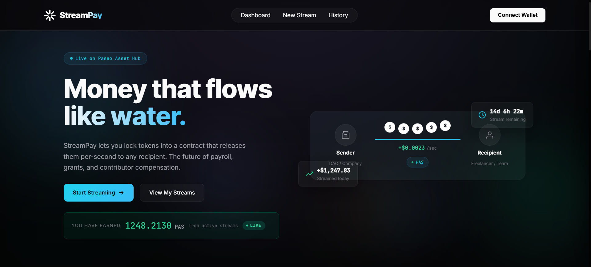
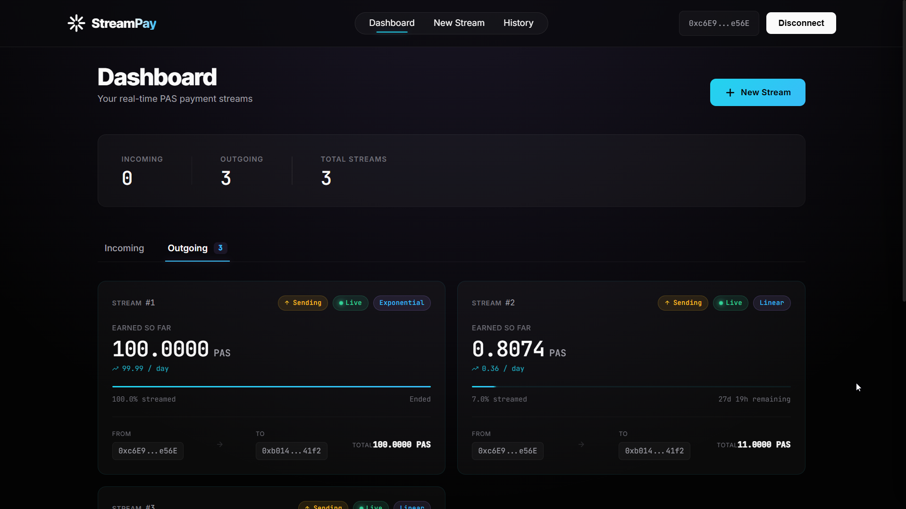
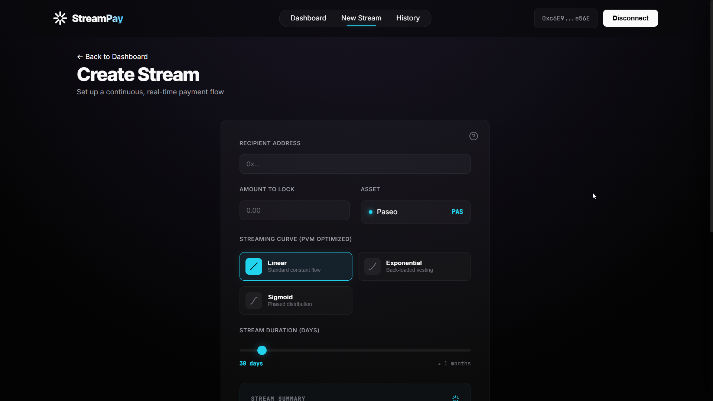
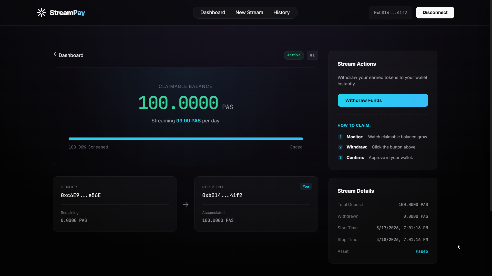

# StreamPay: High-Performance Payment Streaming on Polkadot Hub

**Real-time, second-by-second payments for the Polkadot ecosystem.**

StreamPay is a non-custodial payment streaming protocol designed to empower the next generation of builders on Polkadot. By leveraging the **Polkadot Virtual Machine (PVM)** and **EVM Smart Contracts**, StreamPay enables real-time, per-second distribution of native assets with extreme precision and gas efficiency.



---

## The Problem

Traditional payroll, vesting, and subscription models often rely on lump-sum payments or manual distributions. This approach introduces several inefficiencies:

1. **Trust Deficit:** Recipients must trust that a large lump sum will be sent at the end of a period, creating risk for service providers or employees.
2. **Payment Lag:** Funds that have already been "earned" are locked in a contract or account until a specific date, reducing capital efficiency for the recipient.
3. **Manual Overhead:** Recurring payments often require manual intervention, which is time-consuming and prone to human error.

## The Solution

StreamPay solves these issues by enabling continuous, per-second fund streams:

1. **Continuous Availability:** Funds flow into the recipient's balance every second. They can be withdrawn at any time once earned, eliminating the wait for "payday."
2. **Trustless Non-Custodial Security:** Assets are locked in a smart contract and distributed according to immutable code. Neither the sender nor StreamPay can block access to earned funds.
3. **Programmable Financial Models:** Beyond linear streaming, StreamPay supports Exponential and Sigmoid curves to match real-world business needs like "cliff" vesting or phased project milestones.
4. **PVM-Native Efficiency:** By offloading complex math to the Polkadot Virtual Machine (Rust), StreamPay achieves higher precision and lower gas costs than traditional EVM-only implementations.

---

## Visual Overview

### Dashboard
The main interface for tracking incoming and outgoing streams in real-time.


### Create a Stream
Configure recipient addresses, amounts, and non-linear release curves.


### Withdraw Funds
Recipients can claim their earned balance with a single click at any frequency.


---

## Key Features

- **Non-Linear Streaming Curves:** Choose between Linear (constant), Exponential (back-loaded), or Sigmoid (phased) distribution models.
- **PVM-Native Efficiency:** Offloads complex floating-point math to Rust/PVM for drastically lower gas costs and higher precision.
- **Atomic Deposits & Withdrawals:** Senders lock native tokens once; recipients "claim" their earned balance at any frequency.
- **Real-Time Dashboards:** "Money-in-motion" visual counters for both senders and recipients.
- **Built-in Onboarding:** Integrated "How to Create" and "How to Claim" guides for a seamless user experience.

---

## Hackathon Qualifications

StreamPay is purposefully built to compete in both Track 1 and Track 2 of the Polkadot Solidity Hackathon 2026.

### Track 1: EVM Smart Contract Track
- **Qualification:** StreamPay implements complex DeFi logic through Solidity smart contracts deployed on the Polkadot Hub (Paseo Asset Hub).
- **Focus Area:** DeFi & Payment Infrastructure. It provides a foundational layer for payroll, vesting, and subscriptions within the Polkadot ecosystem.

### Track 2: PVM Smart Contracts
- **Category 1: PVM-experiments:** StreamPay features a Custom PVM Math Extension. High-precision math for non-linear streaming curves (Exponential & Sigmoid) is offloaded to a native Rust precompile, which is then called from Solidity via `staticcall`.
- **Category 2: Polkadot Native Assets:** StreamPay natively streams PAS (Paseo chain token) directly on Asset Hub.
- **Category 3: Precompiles:** The architecture is designed to interface with native Polkadot precompiles for optimized state management and math operations.

---

## Reproducible Details (How to Run)

### 1. Contract Development
The smart contracts are managed via Hardhat.
```bash
cd contracts
npm install
npx hardhat compile
# Deploy to Paseo Asset Hub
npx hardhat run scripts/deploy.ts --network paseo
```

### 2. Frontend Development
The frontend is a modern Next.js 15 application.
```bash
cd frontend
npm install
npm run dev
# Open http://localhost:3000
```

---

## Project Structure

- `/contracts`: Solidity source code, Hardhat configuration, and deployment scripts.
- `/frontend`: Next.js application, Wagmi/Viem hooks, and custom UI components.
- `/brain/PvmMathExtension.rs`: The Rust source for our PVM experiment (Track 2).

---

## Deployment Information (Paseo Asset Hub)

- **Contract Address:** `0x74ABB06A03317AEB37dD45fF0BF58fDc9a165e57`
- **Network:** Paseo Testnet (Asset Hub)
- **Chain ID:** `420420417`
- **RPC:** `https://eth-rpc-testnet.polkadot.io`

---

## Hackathon Context

**Polkadot Solidity Hackathon 2026**
- **Sponsors:** OpenGuild & Web3 Foundation (W3F).
- **Goal:** Accelerate Solidity and PVM smart contract development on Polkadot Hub.
- **Timeline:** Registration (Feb 16) -> Hacking (Mar 1) -> Submission (Mar 20) -> Demo Days (Mar 24-25).

---

## Vercel Deployment (Frontend)

The StreamPay frontend can be easily deployed to Vercel:

1. **Connect Repository**: Log in to [Vercel](https://vercel.com/) and import your GitHub repository.
2. **Configure Project**:
   - **Framework Preset**: Next.js
   - **Root Directory**: Select `frontend` (crucial since this is a monorepo).
3. **Environment Variables**: Add any required `.env` variables in the Vercel dashboard.
4. **Deploy**: Click "Deploy" and enjoy your live application!

---

## Organization

- **OpenGuild:** A Web3 builder community empowering the Polkadot ecosystem in APAC. [Discord](https://discord.gg/WWgzkDfPQF)
- **Web3 Foundation:** Supporting a decentralized internet and the Polkadot protocol. [Website](https://web3.foundation/)

Developed with care for the Polkadot APAC community.
